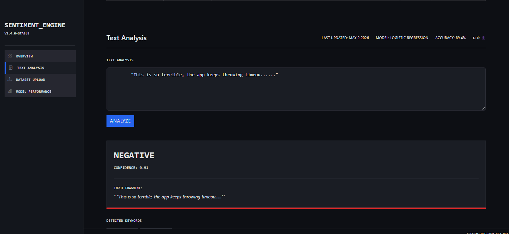
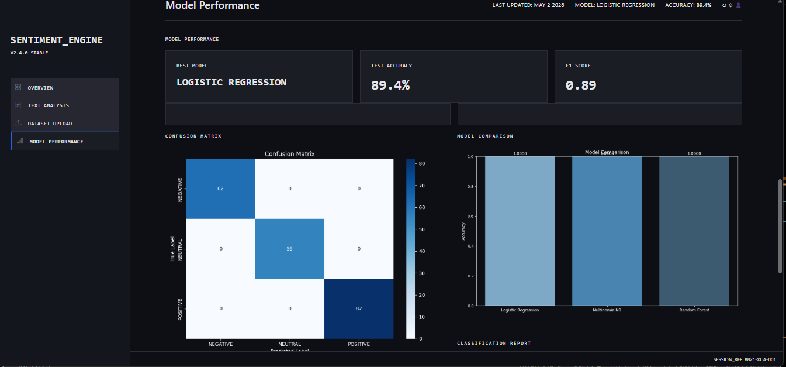
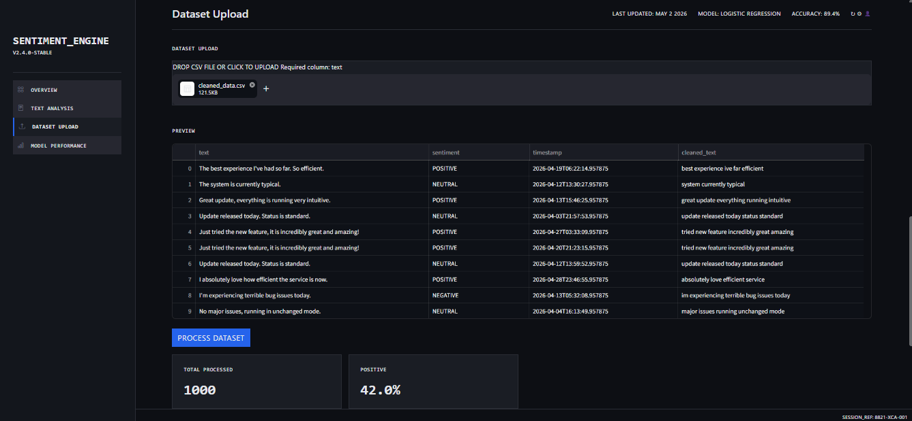

# 📊 Social Media Sentiment Analysis Dashboard

## Overview

This project is an end-to-end **Sentiment Analysis System** that processes social media text data and classifies it into **Positive**, **Negative**, and **Neutral** sentiments.

It combines:

• Machine Learning pipeline
• Text preprocessing
• Interactive dashboard (Streamlit)

The system is designed to provide **real-time insights** and **data-driven decision support** through a modern, user-friendly interface.

## Key Features

#### • Real-time Text Analysis

  Analyze any user input and instantly get sentiment prediction with confidence score

#### • Interactive Dashboard

  Clean UI with charts, metrics, and insights

#### •  Batch Prediction

  Upload CSV files and analyze large datasets

#### • Sentiment Distribution & Trends

  Visual breakdown of Positive / Negative / Neutral

#### • Model Performance Tracking

  Includes accuracy, F1-score, and confusion matrix

#### • Fast & Lightweight ML Pipeline

  Optimized using TF-IDF + Logistic Regression

## Machine Learning Pipeline

### 1. Data Preprocessing

• Text cleaning (lowercase, punctuation removal)
• Stopword removal
• Tokenization

### 2. Feature Engineering

• TF-IDF Vectorization

### 3. Model Training

• Logistic Regression classifier

### 4. Prediction

• Single input prediction
• Batch prediction via uploaded dataset

## Model Performance

| Metric     | Score               |
| ---------- | ------------------- |
| Accuracy   | 89.4%               |
| F1 Score   | 0.89                |
| Model Type | Logistic Regression |

## Dashboard Preview

### 🏠 Overview

### 🔍 Text Analysis

### 📊 Model Performance

### Dataset Upload

## Project Structure

Social-Media-Sentiment-Analysis/
│
├── dashboard/
│ └── app.py
│
├── data/
│ ├── cleaned_data.csv
│ ├── social_media_data.csv
│ ├── timeline_data.csv
│ ├── temp_upload.csv
│ └── generate_data.py
│
├── images/
│ ├── dashboard_overview.png
│ ├── dataset_upload.png
│ ├── model_performance.png
│ └── text_analysis_dashboard.png
│
├── models/
│ ├── model.pkl
│ ├── sentiment_model.pkl
│ └── vectorizer.pkl
│
├── outputs/
│ ├── classification_report.txt
│ ├── confusion_matrix.png
│ ├── model_comparison.png
│ └── sample_predictions.csv
│
├── src/
│ ├── preprocess.py
│ ├── train_model.py
│ ├── predict.py
│ └── utils.py
│
├── main.py
├── requirements.txt
└── README.md

## Installation

### 1. Clone the repository

git clone https://github.com/Nikhatjahan85/social-media-sentiment-analysis.git
cd social-media-sentiment-analysis

## 2. Install dependencies

pip install -r requirements.txt

##  Run the Application

### Run Dashboard

streamlit run dashboard/app.py

### Run Prediction Script

python src/predict.py

##  Dataset

• Labeled dataset containing social media text

• Classes: Positive, Negative, Neutral

• Supports custom dataset upload via dashboard

## Business Applications

• Social media monitoring

• Customer feedback analysis

• Product review insights

• Brand sentiment tracking

• Business intelligence dashboards

## Tech Stack

• Frontend: Streamlit

• Backend: Python

• ML: Scikit-learn

• Data Processing: Pandas, NumPy

• Visualization:  Matplotlib

##  Future Enhancements

• Integration with deep learning models (BERT, LSTM)

• Real-time API deployment

• Cloud deployment (Streamlit Cloud / AWS)

• Multilingual sentiment analysis

• Advanced NLP techniques

## Author

Nikhat Jahan

GitHub: https://github.com/Nikhatjahan85
